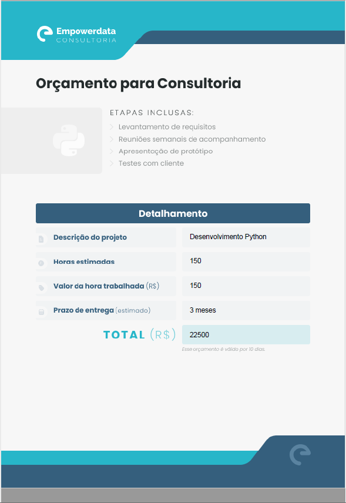

# Semana do Python na Prática - Empowerdata
## 06/03/2023

## ambiente: Jupyter Notebook

## Aula 1:
* imprimir dados na tela do computador
* receber dados do usuário
* entender o que são os tipos de dados
* converter tipos de dados
* utilizar variáveis para armazenar dados
* instalar e utilizar a biblioteca `fpdf`
* projeto 1: Gerar automaticamente PDFs no Python

## projeto 1:
* objetivo: Gerar automaticamente PDFs no Python
* cenário: Emitir orçamentos para sua empresa

